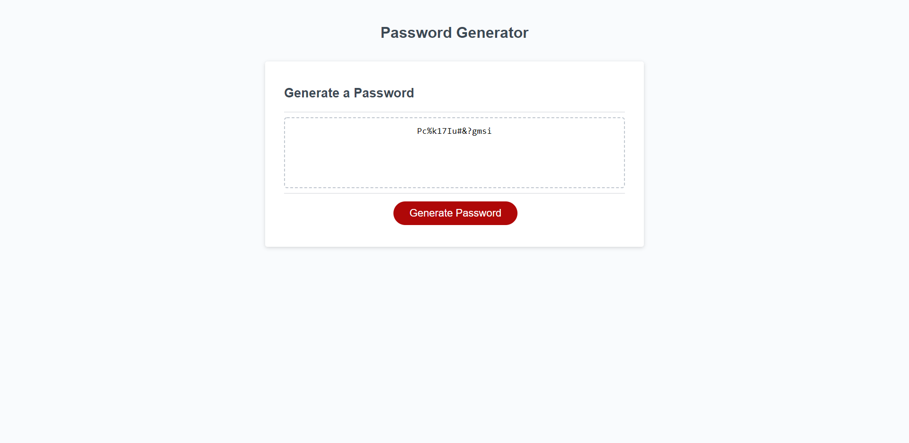

# Password Generator

## Table of Contents
* [Deployed](#deployed)
* [Description](#description)
* [Technologies](#technologies)
* [Usage](#usage)
* [Preview](#preview)
* [Questions](#questions)
* [Credits](#credits)

## Deployed
Access the application at https://sarawrmas.github.io/password-generator/

## Description
This is a password generator that uses a series of prompts to collect the user's choice for password length and included character types. It allows you to come up with a unique, complex password that is virtually hacker proof!

## Technologies
* HTML
* CSS
* JavaScript

## Usage
On page load, you will be prompted to enter a password length. Your password must be at least 8 characters long and no longer than 128 characters. If you choose a length outside of this range, the prompt will warn you and make you pick a new length that is within the specified criteria.

Continue through the prompts, choosing what type of characters you would like to include in your password. If you'd like to include the specified character in your password, select "OK." Otherwise, select "Cancel."

You can pick from:
* Lowercase letters
* Uppercase letters
* Numbers
* Special characters

Once you finish picking your password criteria, click the "Generate Password" button and a password will be created for you. Click the button as many times as you like, and a new password will be created each time.

## Preview

## Questions
Have questions about this project?
GitHub: https://github.com/sarawrmas
Email: sara.m.adamski@gmail.com

## Credits
Sara Adamski